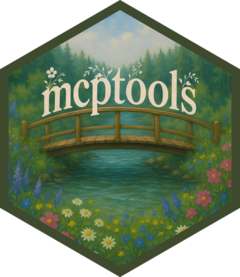

<!-- README.md is generated from README.Rmd. Please edit that file -->

# mcptools <a href="https://posit-dev.github.io/mcptools/"></a>

<!-- badges: start -->

[](https://lifecycle.r-lib.org/articles/stages.html#experimental)
[](https://github.com/posit-dev/mcptools/actions/workflows/R-CMD-check.yaml)
<!-- badges: end -->

mcptools implements the [Model Context
Protocol](https://modelcontextprotocol.io/) in R. There are two sides to
mcptools:

**R as an MCP server**:


When configured with mcptools, MCP-enabled tools like Claude Desktop,
Claude Code, and VS Code GitHub Copilot can run R code *in the sessions
you have running* to answer your questions. While the package supports
configuring arbitrary R functions, you may be interested in the
[btw](https://posit-dev.github.io/btw/) package’s integrated support for
mcptools, which provides a default set of tools to to peruse the
documentation of packages you have installed, check out the objects in
your global environment, and retrieve metadata about your session and
platform.

**R as an MCP client**:


Register third-party MCP servers with ellmer chats to integrate
additional context into
e.g. [shinychat](https://github.com/posit-dev/shinychat) and
[querychat](https://posit-dev.github.io/querychat/) apps.

> NOTE:
>
> This package used to be called acquaint and supplied a default set of
> tools from [btw](https://github.com/posit-dev/btw) when R was used as
> an MCP server. The direction of the dependency has been reversed; to
> use the same functionality from before, transition
> `acquaint::mcp_server()` to `btw::btw_mcp_server()` and
> `acquaint::mcp_session()` to `btw::btw_mcp_session()`.

## Installation

Install mcptools from CRAN with:

``` r
install.packages("mcptools")
```

You can install the development version of mcptools like so:

``` r
pak::pak("posit-dev/mcptools")
```

### R as an MCP server

mcptools can be hooked up to any application that supports MCP. For
example, to use with Claude Desktop, you might paste the following in
your Claude Desktop configuration (on macOS, at
`~/Library/Application Support/Claude/claude_desktop_config.json`):

``` json
{
  "mcpServers": {
    "r-mcptools": {
      "command": "Rscript",
      "args": ["-e", "mcptools::mcp_server()"]
    }
  }
}
```

Or, to use with Claude Code, you might type in a terminal:

``` bash
claude mcp add -s "user" r-mcptools -- Rscript -e "mcptools::mcp_server()"
```

Then, if you’d like models to access variables in specific R sessions,
call `mcptools::mcp_session()` in those sessions. (You might include a
call to this function in your .Rprofile, perhaps using
`usethis::edit_r_profile()`, to automatically register every session you
start up.)

### R as an MCP client

mcptools uses the Claude Desktop configuration file format to register
third-party MCP servers, as most MCP servers provide setup instructions
for Claude Desktop in their documentation. For example, here’s what the
[official GitHub MCP
server](https://github.com/github/github-mcp-server) configuration would
look like:

``` json
{
  "mcpServers": {
    "github": {
      "command": "docker",
      "args": [
        "run",
        "-i",
        "--rm",
        "-e",
        "GITHUB_PERSONAL_ACCESS_TOKEN",
        "ghcr.io/github/github-mcp-server"
      ],
      "env": {
        "GITHUB_PERSONAL_ACCESS_TOKEN": "<YOUR_TOKEN>"
      }
    }
  }
}
```

Once the configuration file has been created (by default, mcptools will
look to `file.path("~", ".config", "mcptools", "config.json")`),
`mcp_tools()` will return a list of ellmer tools which you can pass
directly to the `$set_tools()` method from ellmer:

    ch <- ellmer::chat_anthropic()
    ch$set_tools(mcp_tools())

    ch$chat("What issues are open on posit-dev/mcptools?")

## Example

In Claude Desktop, I’ll write the following:

> “From what year is the earliest recorded sample in the `forested` data
> in my Positron session?”

Without mcptools, Claude couldn’t get far here; by default, it can’t run
R code and doesn’t have any way to “speak to” my interactive R sessions.


Using the package, the model asks to describe the data frame using a
structure that will show summary statistics from the data. mcptools will
appropriately route the request to the open Positron session, forwarding
the results back to the model for it to situate in a response.
